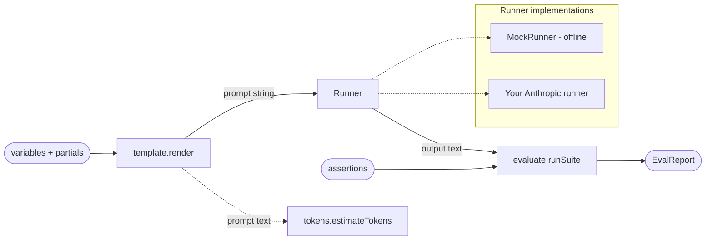

# llm-prompt-lab

A small TypeScript toolkit for prompt engineering: template rendering, a rough token estimator, and an offline evaluation harness — all behind a pluggable model-runner interface.


## Overview

`llm-prompt-lab` is a demo/portfolio project that packages three everyday prompt-engineering chores into one tidy library and CLI:

1. **Template rendering** — `{{ variable }}` interpolation (with dot paths) and reusable `{{> partial }}` includes.
2. **Token estimation** — a fast, dependency-free heuristic for rough budget checks.
3. **Evaluation** — run prompts against fixture cases and assert on the output (`contains`, `regex`, exact `equals`, a small JSON-shape validator, and a `json-path` value check).

Model calls go through a pluggable `Runner` interface. The bundled `MockRunner` makes the entire pipeline run **offline and deterministically**, so tests and the CLI need no API key. Swapping in a real provider is a single small class (see [Usage](#usage)).

## Architecture



The flow is always the same: **template → runner → evaluator**. Each stage is independent and importable on its own.

## Features

- `{{ variable }}` interpolation with dot-path lookup (`{{ user.name }}`).
- `{{> partial }}` includes with recursion and cycle detection.
- Strict mode (throws on missing variables/partials) or lenient mode (blanks them).
- Rough token estimator for single strings and message arrays.
- Evaluation harness with five assertion types: `contains` / `not-contains`, `equals`, `regex`, `json-schema` (a minimal shape validator), and `json-path` (resolve a dot path in JSON output and assert presence or an exact value).
- Pluggable `Runner` interface with a scriptable, offline `MockRunner`.
- A `render` and `eval` CLI, plus a strict, typed public API with JSDoc.

## Tech stack

- **Language:** TypeScript (strict), ESM, Node 20.
- **Build:** [tsup](https://tsup.egoist.dev/) (produces the library + the `bin`).
- **Tests:** [Vitest](https://vitest.dev/).
- **Lint:** ESLint 9 flat config + [typescript-eslint](https://typescript-eslint.io/).
- **Runtime dep:** [`yaml`](https://www.npmjs.com/package/yaml) (so eval suites can be JSON *or* YAML).

## Getting started

```bash
npm install
npm run build
```

Other useful scripts:

```bash
npm test         # run the Vitest suite
npm run lint     # ESLint
npm run typecheck  # tsc --noEmit
```

## Usage

### CLI

Render a template (variables via repeatable `--var`, or a `--data file.json`):

```bash
npx llm-prompt-lab render examples/greeting.tmpl \
  --var name=Ada --var language=English --var topic="type systems"
```

Run an evaluation suite offline (JSON or YAML); exits non-zero if any case fails:

```bash
npx llm-prompt-lab eval examples/suite.json
# add --json for machine-readable output
```

> Before the package is published, use the local build: `node dist/cli.js render …`,
> or run from source with `npm run cli -- render examples/greeting.tmpl --var name=Ada`.

### Library

```ts
import {
  render,
  estimateTokens,
  runSuite,
  MockRunner,
  type EvalSuite,
} from "llm-prompt-lab";

const prompt = render(
  "Summarize this for {{ audience }}:\n{{ text }}\n{{> tone }}",
  { audience: "an executive", text: "Revenue is up 12%." },
  { partials: { tone: "Two sentences max." } },
);

console.log(estimateTokens(prompt)); // rough token count

const suite: EvalSuite = {
  name: "demo",
  cases: [
    {
      name: "mentions the audience",
      prompt,
      assertions: [{ type: "contains", value: "executive" }],
    },
  ],
};

const report = await runSuite(suite, new MockRunner());
console.log(`${report.passed}/${report.total} passed`);
```

There is a runnable version of this in [`examples/usage.ts`](examples/usage.ts): `npx tsx examples/usage.ts`.

### Plugging in a real Anthropic runner

`MockRunner` keeps everything offline. To evaluate against a real model, implement the same `Runner` interface with the [Anthropic SDK](https://www.npmjs.com/package/@anthropic-ai/sdk) (`npm install @anthropic-ai/sdk`, set `ANTHROPIC_API_KEY`):

```ts
import Anthropic from "@anthropic-ai/sdk";
import type { Runner, RunnerRequest, RunnerResponse } from "llm-prompt-lab";

export class AnthropicRunner implements Runner {
  readonly name = "anthropic";
  private client = new Anthropic(); // reads ANTHROPIC_API_KEY

  async run(request: RunnerRequest): Promise<RunnerResponse> {
    const model = request.model ?? "claude-opus-4-8";
    const message = await this.client.messages.create({
      model,
      max_tokens: request.maxTokens ?? 1024,
      system: request.system,
      messages: [{ role: "user", content: request.prompt }],
    });

    const text = message.content
      .filter((block) => block.type === "text")
      .map((block) => block.text)
      .join("");

    return {
      text,
      model: message.model,
      usage: {
        inputTokens: message.usage.input_tokens,
        outputTokens: message.usage.output_tokens,
      },
    };
  }
}
```

Then pass an `AnthropicRunner` instance to `runSuite` wherever you'd use `MockRunner`. The rest of the toolkit is unchanged.

## Project structure

```
llm-prompt-lab/
├── src/
│   ├── index.ts       # public exports
│   ├── template.ts    # render() — {{ variable }} + {{> partial }}
│   ├── tokens.ts      # estimateTokens() — rough heuristic
│   ├── evaluate.ts    # runSuite() + assertions
│   ├── runner.ts      # Runner interface + MockRunner
│   └── cli.ts         # `render` and `eval` commands (bin entry)
├── tests/             # Vitest: template, tokens, evaluate
├── examples/          # sample template, eval suite, usage script
├── .github/workflows/ # CI: lint, test, build on Node 20
├── package.json
├── tsconfig.json
├── tsup.config.ts
├── vitest.config.ts
└── eslint.config.js
```

## Testing

```bash
npm test
```

The suite covers template rendering (interpolation, partials, cycles, strict mode), the token estimator, and the evaluation harness driven by `MockRunner`. Because everything is offline, the tests are fast and deterministic — no network, no API key.

## Roadmap

Honest about what's *not* here yet:

- **Official Anthropic runner** — ship a first-class `AnthropicRunner` (currently a documented example you copy in).
- **Cost tracking** — turn the token estimates into per-run cost figures with configurable model pricing.
- **Real tokenizer option** — allow delegating token counts to a provider endpoint for accuracy.
- **Richer assertions** — numeric tolerances, LLM-graded rubrics.
- **Parallel + streaming evaluation** for larger suites.

## License

[MIT](LICENSE) © 2026 Matthews Wong

---

Part of my cloud & AI portfolio — see [github.com/matthews-wong](https://github.com/matthews-wong).
